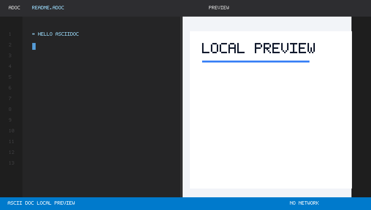

# AsciiDoc Local Preview

[](https://marketplace.visualstudio.com/items?itemName=YoshihideShirai.asciidoc-local-preview)

[](https://marketplace.visualstudio.com/items?itemName=YoshihideShirai.asciidoc-local-preview)
[](https://marketplace.visualstudio.com/items?itemName=YoshihideShirai.asciidoc-local-preview)

[English](README.md) | 日本語

Visual Studio Code で AsciiDoc をローカルプレビューするための拡張機能です。編集中の `.adoc` / `.ad` / `.asciidoc` / `.asc` ファイルを VS Code 内の Webview に表示し、MathJax、Mermaid、PlantUML、Kroki 互換の図表も外部サービスなしで確認できます。



## Highlights

- 編集中の未保存バッファをそのままプレビューに反映します。
- Asciidoctor.js による AsciiDoc プレビューを VS Code 内で実行します。
- MathJax による `stem` / `latexmath` の数式表示に対応しています。
- `emoji:name[]` 形式の絵文字インラインマクロをローカルの Unicode 文字として表示します。
- Mermaid、PlantUML、Nomnoml、Vega、Vega-Lite、WaveDrom、Bytefield の図表をローカルアセットで描画します。
- 太字、斜体、等幅、リンク、見出し、箇条書きなど、よく使う AsciiDoc 編集コマンドを追加します。
- ドキュメントヘッダー、ソースブロック、admonition、表などのスニペットを提供します。
- CDN、Kroki サーバー、外部画像読み込みに依存しないプレビュー経路を重視しています。

## Getting Started

1. VS Code で AsciiDoc ファイルを開きます。
2. コマンドパレットから **AsciiDoc: Open Local AsciiDoc Preview** を実行します。
3. エディタータイトルまたはコンテキストメニューからもプレビューを開けます。

プレビューは編集中の内容に追従します。必要な場合は **AsciiDoc: Refresh Preview** で Webview を再描画できます。

## Supported Diagrams

Kroki 互換のブロック記法で、次の図表をローカルに描画できます。

```asciidoc
[mermaid]
----
graph TD
  A[AsciiDoc] --> B[Local Preview]
----

[plantuml]
....
Alice -> Bob : Hello
....

[nomnoml]
----
[User] -> [VS Code]
----
```

対応している図表:

- Mermaid
- PlantUML
- Nomnoml
- Vega
- Vega-Lite
- WaveDrom
- Bytefield

`mermaid::diagrams/system.mmd[]` や `plantuml::diagrams/sequence.puml[]` のようなローカルファイルマクロも利用できます。マクロの参照先は、ドキュメントと同じディレクトリ配下の相対パスに制限されます。

## Math and Emoji

AsciiDoc の `stem` ブロックや `latexmath` インライン記法を MathJax で表示します。

```asciidoc
latexmath:[E = mc^2]

[stem]
++++
\frac{1}{2}
++++
```

絵文字は `asciidoctor-emoji` 互換のインラインマクロで書けます。

```asciidoc
I emoji:heart[1x] Asciidoctor.js emoji:tada[2x]
```

`1x`、`lg`、`2x`、`3x`、`4x`、`5x`、`42px` のようなサイズ指定に対応しています。絵文字は CDN から SVG を読み込まず、ローカルで Unicode 文字として表示します。

## Local Preview Boundary

AsciiDoc Local Preview は、ドキュメント内容を外部サービスへ送らずにプレビューすることを目指しています。

- Asciidoctor.js は拡張ホスト内で実行されます。
- `allow-uri-read` は明示的に無効化されています。
- Webview CSP は `default-src 'none'` を使用します。
- リモート画像 URL はプレビュー前に空のローカル data image に置き換えられます。
- CSS、MathJax、Mermaid、PlantUML、Nomnoml、Vega、Vega-Lite、WaveDrom、Bytefield は同梱された `media` 配下のファイルから読み込まれます。
- PlantUML の描画に Java、Graphviz、Kroki サーバーは不要です。

公開前や生成コードを取り込む前には、ネットワーク利用を検査するスクリプトを実行できます。

```sh
npm run verify:no-network
```

このチェックは `npm test` の前にも自動実行されます。

## Commands

- **AsciiDoc: Open Local AsciiDoc Preview**
- **AsciiDoc: Refresh Preview**
- **AsciiDoc: Bold**
- **AsciiDoc: Italic**
- **AsciiDoc: Monospace**
- **AsciiDoc: Insert Link**
- **AsciiDoc: Insert Section Heading**
- **AsciiDoc: Insert Unordered List**

## Development

```sh
npm install
npm run compile
npm run lint
npm run verify:no-network
npm test
```

## Bundled Licenses

The bundled preview stylesheet is adapted from the Antora Default UI project and keeps its MPL-2.0 license notice in `media/antora-default-preview.css`.

Bundled MathJax assets keep Apache-2.0 license copies in `media/mathjax/LICENSE` and `media/mathjax-newcm/LICENSE`.

The emoji name map is generated from `asciidoctor-emoji` and keeps its MIT license copy in `licenses/asciidoctor-emoji-LICENSE`.

The AsciiDoc file and extension icons are adapted from the `vscode-icons` project and keep its MIT license copy in `licenses/vscode-icons-LICENSE`.
