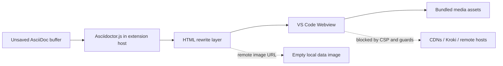

# AsciiDoc Zero-Network Preview

[](https://marketplace.visualstudio.com/items?itemName=YoshihideShirai.asciidoc-local-preview)
[](https://marketplace.visualstudio.com/items?itemName=YoshihideShirai.asciidoc-local-preview)
[](https://marketplace.visualstudio.com/items?itemName=YoshihideShirai.asciidoc-local-preview)

English | [日本語](README.ja.md)

AsciiDoc Zero-Network Preview is a Visual Studio Code extension for previewing AsciiDoc files locally. It renders the active `.adoc`, `.ad`, `.asciidoc`, or `.asc` editor buffer in a VS Code Webview, with MathJax, Mermaid, PlantUML, and Kroki-compatible diagrams available without external services.

Ideal for:

- Corporate environments
- Air-gapped networks
- Security-sensitive documentation
- Organizations that prohibit external services


## Highlights

- Updates the preview from the unsaved editor buffer.
- Renders AsciiDoc inside VS Code with Asciidoctor.js.
- Supports MathJax for AsciiDoc `stem` blocks and `latexmath` expressions.
- Numbers figure, table, and equation captions with chapter-aware prefixes.
- Renders `emoji:name[]` inline macros as local Unicode emoji.
- Draws Mermaid, PlantUML, Nomnoml, Vega, Vega-Lite, WaveDrom, and Bytefield diagrams from bundled local assets.
- Adds common AsciiDoc editing commands for bold, italic, monospace, links, headings, and unordered lists.
- Coexists with `asciidoctor/asciidoctor-vscode` by leaving AsciiDoc language support, grammar, snippets, and file icons to that extension.
- Keeps the preview path independent of CDNs, Kroki servers, and remote image loading.


## Differentiators

AsciiDoc Zero-Network Preview is narrower than `asciidoctor/asciidoctor-vscode`: it focuses on safe local preview.

| Area | AsciiDoc Zero-Network Preview | `asciidoctor/asciidoctor-vscode` |
| --- | --- | --- |
| Focus | Local preview | Full AsciiDoc authoring |
| Diagrams | Bundled local renderers | Broad Kroki support |
| External send | Avoided by default | Used with Kroki |
| PlantUML | No Java / Graphviz | Via Kroki |
| Math / emoji | Bundled MathJax / emoji | Extensions available |
| Export | None | PDF / HTML / DocBook |
| Best for | Confidential or offline checks | Conversion and publishing |

AsciiDoc Zero-Network Preview does not contribute its own `asciidoc` language definition or TextMate grammar. If you want syntax highlighting, snippets, file associations, PDF export, or broader authoring support, install `asciidoctor/asciidoctor-vscode` alongside this extension.

## Built-in Asciidoctor.js Extensions

The preview registers these Asciidoctor.js extensions before converting each document:

| Extension | Syntax / target | Purpose |
| --- | --- | --- |
| Diagram block processor | `[mermaid]`, `[plantuml]`, `[nomnoml]`, `[vega]`, `[vegalite]`, `[wavedrom]`, `[bytefield]` | Converts diagram blocks into local Webview render targets. |
| Diagram block macro processor | `mermaid::path[]`, `plantuml::path[]`, and matching diagram macros | Reads local diagram source files relative to the document directory. |
| Diagram literal preprocessor | `[mermaid] ....` and matching diagram literal blocks | Normalizes literal diagram blocks so they render through the same local pipeline. |
| Emoji inline macro processor | `emoji:name[]` | Renders `asciidoctor-emoji` compatible inline macros as local Unicode emoji. |
| Numbered captions tree processor | image, table, and stem blocks | Applies `asciidoctor-numbered-captions` chapter-aware caption numbering. |

## Getting Started

1. Open an AsciiDoc file in VS Code.
2. Run **AsciiDoc: Open Zero-Network Preview** from the Command Palette.
3. You can also open the preview from the editor title menu or editor context menu.

The preview follows changes in the active editor. If the Webview needs to be redrawn manually, run **AsciiDoc: Refresh Preview**.

## Supported Diagrams

Use Kroki-compatible block syntax to render diagrams locally.

```asciidoc
[mermaid]
----
graph TD
  A[AsciiDoc] --> B[Local Preview]
----

[plantuml]
....
Alice -> Bob : Hello
....

[nomnoml]
----
[User] -> [VS Code]
----
```

Supported diagram types:

- Mermaid
- PlantUML
- Nomnoml
- Vega
- Vega-Lite
- WaveDrom
- Bytefield

Local file macros such as `mermaid::diagrams/system.mmd[]` and `plantuml::diagrams/sequence.puml[]` are supported too. Macro targets must be relative paths inside the document directory.

## Math and Emoji

Render AsciiDoc `stem` blocks and `latexmath` inline expressions with MathJax.

```asciidoc
latexmath:[E = mc^2]

[stem]
++++
\frac{1}{2}
++++
```

Use `asciidoctor-emoji` compatible inline macros for emoji.

```asciidoc
I emoji:heart[1x] Asciidoctor.js emoji:tada[2x]
```

Supported emoji sizes include `1x`, `lg`, `2x`, `3x`, `4x`, `5x`, and explicit pixel sizes such as `42px`. Emoji are rendered as local Unicode text instead of loading SVGs from a CDN.

## Numbered Captions

Figure, table, and equation captions use `asciidoctor-numbered-captions` so numbering includes the current chapter, such as `Figure 1-1`, `Table 2-3`, or `Equation 4-2`.

To use Asciidoctor's standard caption numbering for a document, add this header attribute:

```asciidoc
:numbered-captions-numbering: standard
```

## Local Preview Boundary

AsciiDoc Zero-Network Preview is designed so local preview does not send document contents to CDNs, Kroki servers, remote image hosts, or other external services. The boundary is enforced in several layers instead of relying on a single "secure by intent" claim.



The preview path uses these controls:

- Asciidoctor.js runs in the extension host with `safe: 'safe'`.
- `allow-uri-read` is explicitly disabled during conversion.
- Remote image URLs are replaced with an empty local data image before rendering.
- Webview `localResourceRoots` are limited to the extension directory, workspace folders, and the current document directory.
- CSS, MathJax, Mermaid, PlantUML, Nomnoml, Vega, Vega-Lite, WaveDrom, and Bytefield load from bundled files under `media`.
- PlantUML rendering does not require Java, Graphviz, or a Kroki server.

### No-network verification

Before publishing or accepting generated changes, run the no-network audit:

```sh
npm run verify:no-network
```

The script fails on common regression patterns in extension-controlled code:

- Browser network APIs such as `fetch`, `XMLHttpRequest`, `WebSocket`, and `EventSource`.
- Node network module imports such as `http`, `https`, `net`, `tls`, `dns`, and related modules.
- Process execution APIs such as `child_process`, `spawn`, and `exec`.
- Remote URL literals in runtime code.
- CSP directives that allow remote `http`, `https`, `wss`, or wildcard sources.
- `allow-uri-read: true` or `safe: 'unsafe'` in Asciidoctor conversion.
- Runtime dependencies outside the local-preview allowlist.

The audit also checks that vendored preview libraries are protected by Webview guards for `fetch`, `XMLHttpRequest`, `WebSocket`, `EventSource`, and `navigator.sendBeacon`. This check runs automatically before `npm test`.

### CSP design

The Webview starts from `default-src 'none'` and then opens only the sources required for local rendering.

| Directive | Policy | Reason |
| --- | --- | --- |
| `default-src` | `'none'` | Deny all loading unless another directive allows it. |
| `img-src` | Webview local source plus `data:` | Allow rewritten local images and the empty placeholder image. |
| `font-src` | Webview local source | Load bundled MathJax fonts only. |
| `style-src` | Webview local source plus inline styles | Load bundled preview CSS and document-scoped styles. |
| `script-src` | Webview local source plus a nonce and WASM eval | Run only bundled renderer scripts and nonce-marked bootstrapping code. |
| `connect-src` | Not set | Keep network connections denied by `default-src 'none'`. |

## Commands

- **AsciiDoc: Open Zero-Network Preview**
- **AsciiDoc: Refresh Preview**
- **AsciiDoc: Bold**
- **AsciiDoc: Italic**
- **AsciiDoc: Monospace**
- **AsciiDoc: Insert Link**
- **AsciiDoc: Insert Section Heading**
- **AsciiDoc: Insert Unordered List**

## Development

```sh
npm install
npm run compile
npm run lint
npm run verify:no-network
npm test
```

## Bundled Licenses

The bundled preview stylesheet is adapted from the Antora Default UI project and keeps its MPL-2.0 license notice in `media/antora-default-preview.css`.

Bundled MathJax assets keep Apache-2.0 license copies in `media/mathjax/LICENSE` and `media/mathjax-newcm/LICENSE`.

The emoji name map is generated from `asciidoctor-emoji` and keeps its MIT license copy in `licenses/asciidoctor-emoji-LICENSE`.

The AsciiDoc file and extension icons are adapted from the `vscode-icons` project and keep its MIT license copy in `licenses/vscode-icons-LICENSE`.
